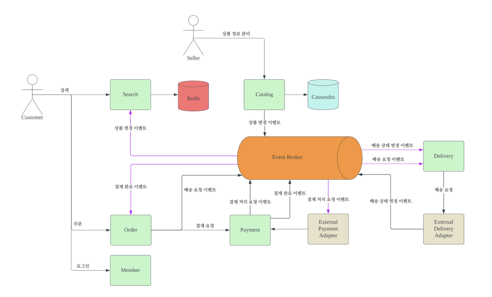
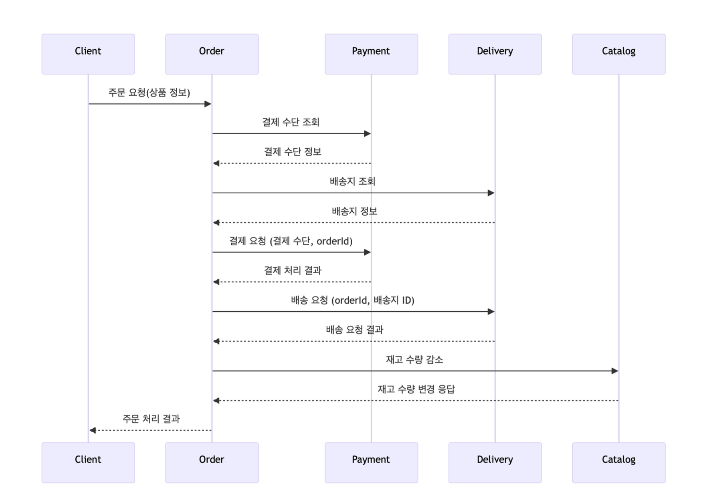

# Order-Payment-Delivery-EDA

## 프로젝트 개요
e-commerce의 구매 - 결제 - 배송 프로세스를 EDA(Event Driven Architecture)로 구현 한다.

## 프로젝트 목표
100만명의 동시 접속자를 안정적으로 처리한다.
- 100만명의 유저가 10분에 한번씩 구매를 진행한다.
- 분당 10만건의 구매를 처리한다.
- 초당 1666건의 구매를 처리한다.

## 개발 환경
- CPU: Apple M3 11core
- MEMORY: 18G
- DISK: 512G
- IntelliJ memory setting(-Xmx4096m)

## 기술 스택
- **JDK**: OpenJDK 17
- **Framework**: Spring Boot 3.2.2
- **Database**: Cassandra
- **Queue**: Kafka
- **Build**: Docker

## 시스템 다이어그램

## 시퀀스 다이어그램

## 주요 기능

- **병목 지점 해결**:
    - 빈번한 상품 정보 변경 -> NoSQL 사용
    - 주문 처리 시 결제, 배송 관련 외부 시스템 등의 병목 -> EDA 사용

- **EDA 적용**
    - 결제 처리(외부 연동을 통해야 하기 때문에 처리가 오래 걸릴 수 있음)
    - 배송 처리(배송 요청시 응답이 필요 없고 수행해야 하는 동작만 있어서 비동기 처리에 적합)
    - 검색어에 대한 캐시(색인) 업데이트(약간의 지연이 허용되기 때문에 비동기 처리 & 대량 처리가 용이함)

